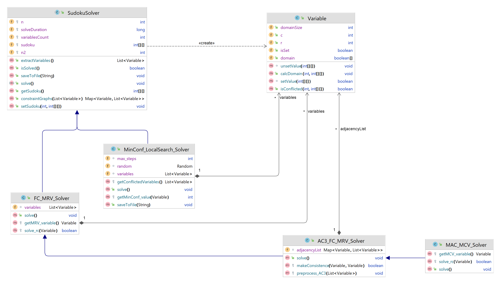

# Solver Sudoku with CSP Algorithms 
This repository contains the following CSP algorithms to solve the given $n^2 × n^2$ sudoku:
1. Forward checking(FC) + Minimum remained value(MRV) 
2. Arc consistency(AC3) + Forward checking(FC) + Minimum remained value(MRV)
3. Local search min-conflicts
4. Maintaining arc consistency(MAC) + Minimum conflicted value(MCV)

# About Constraint Satisfaction Problem (CSP)
Constraint satisfaction problems (CSPs) are mathematical questions defined as a set of objects whose state must satisfy a number of constraints or limitations. CSPs represent the entities in a problem as a homogeneous collection of finite constraints over variables, which is solved by constraint satisfaction methods. CSPs are the subject of research in both artificial intelligence and operations research, since the regularity in their formulation provides a common basis to analyze and solve problems of many seemingly unrelated families [[Wiki](https://en.wikipedia.org/wiki/Constraint_satisfaction_problem)]

# Project structure
